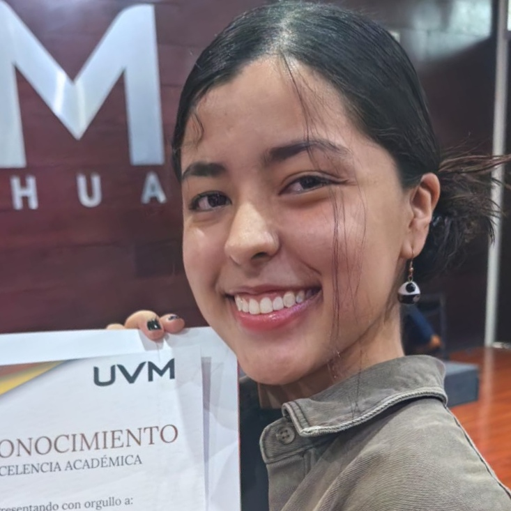

# Presentación Personal de Jaz GC

Este proyecto es un **Currículum Vitae o Presentación** interactiva de Jaz GC, con un diseño sencillo pero atractivo. Se ha creado utilizando HTML y CSS para presentar de manera ordenada y clara la información sobre la formación académica, experiencia, habilidades, pasatiempos y formas de contacto.

## Características

- **Estructura HTML semántica**: Se utilizan etiquetas como `<header>`, `<main>`, `<section>`, `<footer>`, `<ul>`, y `<h1>`, `<h2>`, `<h3>`, para una mejor accesibilidad y organización del contenido.
- **Estilo en CSS**: Se aplica un diseño limpio y organizado con un enfoque en la legibilidad, utilizando propiedades como **flexbox**, **box-shadow**, **border-radius**, y más para mejorar la apariencia visual.
- **Navegación**: Barra de navegación para acceder fácilmente a las diferentes secciones del CV.
- **Imagen de perfil**: Se incluye una imagen redonda en la sección de presentación personal.
- **Enlaces**: Enlaces hacia las redes sociales y un correo electrónico para facilitar el contacto.
- **Contenido Responsivo**: Se ha implementado un diseño adaptativo que permite que el sitio se vea bien en dispositivos móviles.

## Estructura del Proyecto

El proyecto consta de los siguientes archivos principales:

### **index.html**

Este archivo contiene la estructura de la presentación, organizado en secciones que incluyen información sobre la persona, formación profesional, capacitaciones, pasatiempos y formas de contacto.

### **stylesheet.css**

El archivo CSS define el estilo visual de la página, estableciendo colores, tipografía, márgenes, y efectos de diseño como bordes redondeados, sombras, y más. El estilo también incluye un diseño responsive para que la presentación se vea bien en dispositivos móviles.

## Despliegue

Para ver el proyecto en acción, sigue estos pasos:

1. **Clona este repositorio**:
   ```bash
   git clone https://github.com/dreaminarie/ProyectoFinal-M.git
Abre el proyecto en tu navegador:

2. **Navega al directorio del proyecto**:
    cd mi-proyecto

3. **Abre el archivo index.html en tu navegador de preferencia (solo haz doble clic sobre él o usa el comando open en Mac o start en Windows)**:
    open index.html    # En MacOS
    start index.html   # En Windows

4. **Ver el resultado**: 
El CV debería verse de inmediato en tu navegador, con un diseño limpio y organizado. Además, las imágenes y enlaces funcionarán correctamente.

## Personalización
Si deseas personalizar este CV para tu propio uso, puedes:

- Cambiar la imagen de perfil en la etiqueta  por tu propia foto.
- Editar las secciones de información como Sobre mí, Capacitación, Educación, etc.
- Modificar los enlaces en la sección de Contacto para tus redes sociales, correo electrónico, etc.

## Tecnologías utilizadas
- HTML5: Para la estructura del contenido.
- CSS3: Para los estilos y el diseño visual, incluyendo flexbox y diseño responsivo.